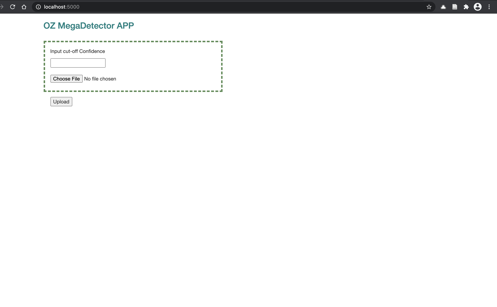

# Oz MegaDetectorApp

MegaDetectorAPP is a minimal web interface designed to sift through camera trap images and classify them. Depending on the pre-trained model it can classify images into Animal and Non-animals (human, vehicle, empty) or further into animal species.

# Background

Microsoft AI for Earth has created (using North America animal images) a camera trap (automatically triggered camera that senses changes in the local environment) image detection and annotations [ML model](https://github.com/microsoft/CameraTraps) that identifies if (and where) there is a human or an animal in the picture since most (>80%) of camera trap images are empty false signals (Microsoft, 2020). This effort is to reduce human time investment in shifting through massive number of images and accelerate the timeline of research projects involving such datasets (Yang, 2020). The project also involves a second downstream model that is unique to different ecosystem that will, with further training, annotate the animal in the picture (Yang, 2020).  

This webapp is part of the project to import the MegaDetector model to Australia to support ecology research and conservation efforts. This project aims to leverage conservation efforts by increasing efficiency in conservation research; massive amount of time is spent in conservation research shifting through the camera-trap data, throwing out falsely signals, and identifying the animal (Yang, 2020). There is ongoing joint work between Microsoft and DPIE NSW to update the pre-trained model to Australian context and once the model is updated this webapp will serve as a no-code/minimal-code interface to use the model. It can also be used with existing MegaDetector model (as will be demonstrated in the documentation) to classify images into animals and non-animals.

# Creating a local copy, deploying, and validating

1. Set up a Virtual Environment (assuming you have Conda installed) with ```requirements.txt```:
   
   ```
   $ git clone https://github.com/5183nischal/MegaDetectorAPP.git
   $ cd MegaDetectorAPP
   $ conda create --name <environment-name> python=3.6
   $ conda actiate <environment-name>
   $ pip install pip install -r requirements.txt
   ```
   
2. Download and add the pre-trained model to the folder. For example, you can access Microsoft's pretrained ```md_v4.1.0.pb``` MegaDetector model by [here](https://lilablobssc.blob.core.windows.net/models/camera_traps/megadetector/md_v4.1.0/md_v4.1.0.pb). Older models can be found [here](https://github.com/microsoft/CameraTraps/blob/master/megadetector.md#downloading-the-models).

3. Run ```$ python app.py```
   
4. Go to [local host](http://127.0.0.1:5000/).
   
5. You can use your own camera trap data set or you can try the test data set that we have provided. On the webapp choose a confidence level value (say 0.95) and upload the ```test_data.zip``` file. Once the processing is complete the download will automatically start and you can open the downloaded zip file to find the sorted images.

# Using the WebApp

The webpage should look like this:




In the first box you can enter your tolerance level (0-1) for classification. Animals will be positively identified provided that the model is more confident about the classification than the value you provide. So, 0.95 would mean that the model will only positively identify and classify animal that it is 95% or more confident is correct.

Then, you can upload a compressed (zipped) file that contains images or nested folders with images. Depending on the processor you are using the processing time can vary for quick-ish to long. To follow the processing stage precisely you can find a progress bar that looks like the follows in the terminal:

# Data, Pervious work, and Maintainance

This project lies at the confluence of activities from Microsoft, 3A Institute, and DPIE NSW. Crucially, it relies on existing work from Microsoft AI for Earth, where they initiated and created a deep learning model for classifying camera trap images. Automating this classification task can massively improve the efficiency of ecology research activity and conservation effort. As such, DPIE NSW and Microsoft Australia had partnered to create an Australian model by using camera trap data from DPIE. After initial conversations, it was clear that the model might not have delivered the promise quite completely as the time and effort that would have gone into manually sorting images now went into learning coding and making the model work. Microsoft had the model and rangers and scientists had a use for the model, but the bridge was too costly.

This webapp is designed to be model agnostic (provided variable consistency) in the sense that with minimal amount of work one can take a trained model and create an easy interface on top of it. In the spirit of data responsibility, the project involved no direct access to DPIE's sensitive data or data storage platform and will only rely on the final trained model coming out of it. As a placeholder, we are using publicly available  model published by Microsoft.

Below is a short introduction on maintaining and updating the code.

The webapp operates with a virtual environment in order to shield itself from changes in the packages it uses. 

If you have a new updated model say ```md_X.pb```, you should make the following changes to incorporate it.

- Save ```md_X.pb``` to the app folder.
-  In ```app.py``` replace:
   - ```tf_detector = TFDetector(model_path='md_v4.1.0.pb', ...)```
    with 
    ```tf_detector = TFDetector(model_path='md_X.pb', ...)```
- Update the category dictionary (that keeps track of relevant species the model detects) in ```annotation_constants.py```
  - The dictionary includes: ```annotation_bbox_categories``` and ```detector_bbox_categories```


# Project History and Management

The final webapp is a result of collaboration and feedback from different stakeholders and are supported by use of some cybernetic methods. Following is a recall of the project path with some reflections:

- Initial tripartite conversation with DPIE, Microsoft, and me as a 3A Institute capstone student: Surveyed the project status. Frustration with handling and using the model at code level was clear. After the conversation that included a Ranger, the conclusion was to make something that would allow Rangers and scientists to do the field and research work rather than code wrangling.
- Identified the interface as the key bottleneck in the research ecosystem, and used affordance analysis to design a webapp. The focus was creating an easy interface that leveraged existing technical knowledge such as using zip files instead of developing new skills such as coding with tenserflow.
- Another round of tripartite conversation with updates on progress. Features (such as confidence level cut off) were added after feedback from the conversation.
- Decision point where we had to choose between making the webapp a tool for the training process versus a final interface after the project is over. After deliberation and using the NGO method decided to go with the latter.

For more cybernetics related reflections and documentation, check out this [pdf](Cybenetics_MegadetectorAPP.pdf).

During the whole process, communication channels were maintained on Teams that included a regular meeting with Steve from Microsoft and ocassional tripartite meeting. A running tally of tasks and next steps were maintained usig github's project management tool.

Some features I'd have love to have implemented but couldn't and would make a good extension to the project:

- Adding a progressbar on the ML inference task on images. The ML inference task can take a long time depending on the processor so a progressbar on the front-end might be useful. Currently the progressbar can be accesed through the terminal that hosts the webapp. Note that this might need some multithreading in the backend.
- Hosting on cloud using Azure. This would be the immediate next step for me, and Microsoft is probably interested in hosting once the Australian model is trained.


## References

Yang, S. (2020, March 23). Accelerating biodiversity surveys with Azure Machine Learning. Medium. https://medium.com/microsoftazure/accelerating-biodiversity-surveys-with-azure-machine-learning-9be53f41e674 

Microsoft. (2020). microsoft/CameraTraps. GitHub. https://github.com/microsoft/CameraTraps 


